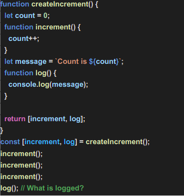

# Exercise 3.3:

 - log(): This function will print "Count is 0"
 - This is because when createIncrement() was invoked at that time let count = 0 & let message = "Count is 0"  was assigned.
 - Before log() was called increment() was called 3 times but this doesn't effect the count value in log() as already count was attached to as a string and assigned to message when its value was zero now log() will log "Count is 0" due to closer effect.
